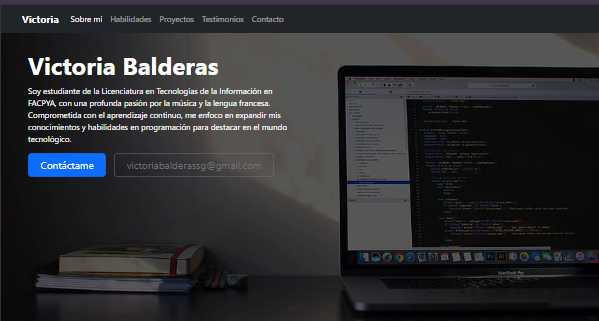
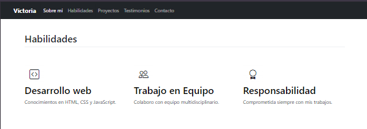
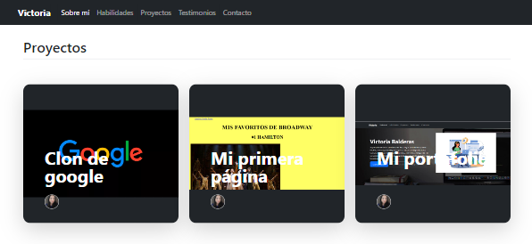
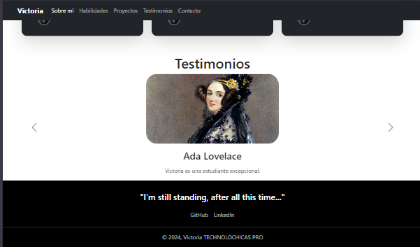

# Mi portafolio de TECNOLOCHICAS PRO

El presente proyecto es un portafolio desarrollado para poner en práctica las habilidades obtenidas dentro del bootcamp de desarrollo frontend de Tecnolochicas Pro. 

Fue dessarrollado en HTML, CSS y JS con el uso del framework de UI, Bootstrap, utilizando además bibliotecas externas 

La página es responsibla (adaptable a diferentes tamaños de pantalla) e incluye presentación de la autora del proyecto. 

Proyecto desplegado https://zippy-cobbler-b52f76.netlify.app/ 

## Secciones de mi sitio 

## Tecnologías 
* HTML
* CSS
* JavaScript
* Bootstrap

---

Desarrollado con <3 por [Victoria](https://linkedin.com/in/victoria-balderass) en [Tecnolochicas](https://tecnolochicas.mx/)

[def]: "assets/readme/presentacion.png"